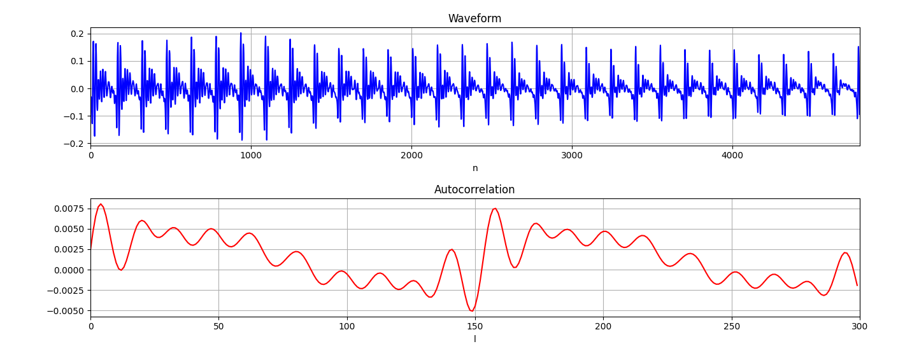
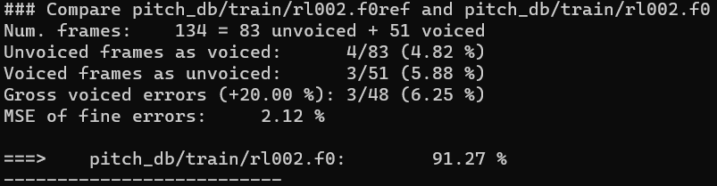
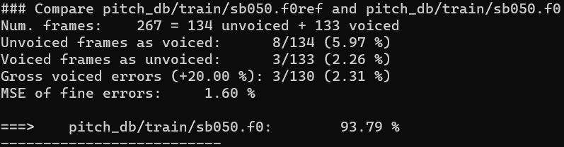
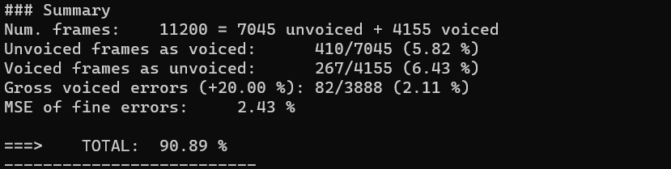

PAV - P3: detección de pitch
============================

Esta práctica se distribuye a través del repositorio GitHub [Práctica 3](https://github.com/albino-pav/P3).
Siga las instrucciones de la [Práctica 2](https://github.com/albino-pav/P2) para realizar un `fork` de la
misma y distribuir copias locales (*clones*) del mismo a los distintos integrantes del grupo de prácticas.

Recuerde realizar el *pull request* al repositorio original una vez completada la práctica.

Ejercicios básicos
------------------

- Complete el código de los ficheros necesarios para realizar la detección de pitch usando el programa
  `get_pitch`.

   * Complete el cálculo de la autocorrelación e inserte a continuación el código correspondiente.

```cpp
  void PitchAnalyzer::autocorrelation(const vector<float> &x, vector<float> &r) const {

    for (unsigned int l = 0; l < r.size(); ++l) {
      float sum = 0;
      for (unsigned int i = 0; i < (frameLen-l); i++){
        sum += x[i]*x[i+l];
      }
      r[l] = sum/frameLen;
    }
    if (r[0] == 0.0F) //to avoid log() and divide zero 
      r[0] = 1e-10; 
  }
```

   * Inserte una gŕafica donde, en un *subplot*, se vea con claridad la señal temporal de un segmento de
     unos 30 ms de un fonema sonoro y su periodo de pitch; y, en otro *subplot*, se vea con claridad la
	 autocorrelación de la señal y la posición del primer máximo secundario.

	 NOTA: es más que probable que tenga que usar Python, Octave/MATLAB u otro programa semejante para
	 hacerlo. Se valorará la utilización de la librería matplotlib de Python.

<br>_El código requerido para realizar la gráfica se puede encontrar en _src/get_pitch/plotP1.2_. A continuación la gráfica realizada con **Matplotlib**._
<br><br><br>

_Donde podemos ver con calidad su periodo de pitch en la Waveform._


_Y en la gráfica de la autocorrelación también, donde la posición del primer máximo secundario está aproximadamente en 155 Hz._


   * Determine el mejor candidato para el periodo de pitch localizando el primer máximo secundario de la
     autocorrelación. Inserte a continuación el código correspondiente.

_Se analiza un fragmento de la señal para detectar la periodicidad mediante el enventanado, ya que necesitamos como mínimo dos periodos de pitch._

_Hemos utilizado la ventana Hamming, que se implementa en el método **`set_window`_**

_Para la implemtación partimos de la formúla:_

 w_h_m(n)=0.54-0.46cos(\frac{2\pi n}{N-1} )


_Que se encuentra en el siguiente link:_ [Procesamiento digital de la señal, Pág:11](http://ccc.inaoep.mx/~pgomez/cursos/pds/slides/S10-WavP1.pdf)

```cpp
void PitchAnalyzer::set_window(Window win_type) {
    if (frameLen == 0)
      return;

    window.resize(frameLen);

    switch (win_type) {
    case HAMMING:
      for(unsigned int i=0; i<frameLen; i++){
        window[i]=0.54F - 0.46F*cos((2*M_PI*i)/(frameLen-1));
      }
      break;
    case RECT:
    default:
      window.assign(frameLen, 1);
    }
  }
 ```
_Una vez hemos enventado nuestra señal, podemos localizar el primer máximo secundario de la autocorrelación que nos permitirá obtener el mejor candidato para el periodo de pitch._

_Sea implementado en el método **`compute_pitch`** con las condiciones que se nos indicaba._
_Por una parte, con el iterador avanzamos por la autocorrelación, obteniendo los valores positivos en vez de obtener valores negativos que están fuera del lóbulo principal.

_A continuación realiza una comparación dando el valor máximo del pitch._

 ```cpp
 vector<float>::const_iterator iR = r.begin()+npitch_min, iRMax = iR;

  while(*iR>0) iR++;

  iRMax=iR;

  while(iR != r.end()){

      if(*iR >= *iRMax) iRMax = iR;//Guardamos en iRMax, la posición donde está el máximo
      iR++;

  }
    unsigned int lag = iRMax - r.begin();

    float pot = 10 * log10(r[0]);
 ```

   * Implemente la regla de decisión sonoro o sordo e inserte el código correspondiente.

_Con el objetivo de detectar si un fragmento de voz es sordo o sonoro, usaremos el criterio de la potencia media, 
es decir, si la potencia supera el umbral, se trata de un fragmento de voz sonoro, 
y sino decidimos que el fragmento de voz sordo._

_Por otra parte miramos la relación entre el valor de la autocorrelación en distintas muestras y 
el valor de la autocorrelació en su máximo secundario._ 

```cpp
  bool PitchAnalyzer::unvoiced(float pot, float r1norm, float rmaxnorm) const {

    if (pot > -48.9F && (r1norm > 0.93F || rmaxnorm > 0.45F)) return false;
    else return true;

  }
```


- Una vez completados los puntos anteriores, dispondrá de una primera versión del detector de pitch. El 
  resto del trabajo consiste, básicamente, en obtener las mejores prestaciones posibles con él.

  * Utilice el programa `wavesurfer` para analizar las condiciones apropiadas para determinar si un
    segmento es sonoro o sordo. 
	
	  - Inserte una gráfica con la detección de pitch incorporada a `wavesurfer` y, junto a ella, los 
	    principales candidatos para determinar la sonoridad de la voz: el nivel de potencia de la señal
		(r[0]), la autocorrelación normalizada de uno (r1norm = r[1] / r[0]) y el valor de la
		autocorrelación en su máximo secundario (rmaxnorm = r[lag] / r[0]).

		Puede considerar, también, la conveniencia de usar la tasa de cruces por cero.

	    Recuerde configurar los paneles de datos para que el desplazamiento de ventana sea el adecuado, que
		en esta práctica es de 15 ms.


      - Use el detector de pitch implementado en el programa `wavesurfer` en una señal de prueba y compare
	    su resultado con el obtenido por la mejor versión de su propio sistema.  Inserte una gráfica
		ilustrativa del resultado de ambos detectores.
  


  * Optimice los parámetros de su sistema de detección de pitch e inserte una tabla con las tasas de error
    y el *score* TOTAL proporcionados por `pitch_evaluate` en la evaluación de la base de datos 
	`pitch_db/train`..

_Después de comprobar el correcto funcionamiento con
el archivo de audio procedemos a evaluar el
sistema con la base de datos que nos proporciona._




.... .... .... ..... ..... ..... ...... ..... .... .... 





_Al ejecutar el sistema con la base de datos proporcionada. Observamos el porcentaje de error para cada archivo de audio._

_Por una parte **unvoiced frames as voiced** nos indica el porcentaje de error de tramas sordas ha sido detectadas como sonoras y **voiced frames as unvoiced** indicando el porcentaje de error de tramas sonoras ha sido detectadas como sordas._

_Al final del **summary** obtenemos el porcentaje **TOTAL** del índice de calidad del detector._


|###Summary  |                        |                     
------------------------|---------------------|
|**Num. frames:**                          | 11200 = 7045 unvoiced + 4155 voiced |                   
|**Unvoiced frames as voiced:**            | 409/7045 **(5.81 %)**               |
|**Voiced frames as unvoiced:**            | 267/4155 **(6.43 %)**               |         
|**Gross voiced errors (+20.00 %):**       | 84/3888  **(2.16 %)**               |
|**MSE of fine errors:** **2.43 %**        |                                     |
|==> **TOTAL: 90.89%**|
  <br>
_Respecto a los resultados obtenidos son bastante positivos obteniendo un índice de calidad de detector del **90.89%**,
dado que los porcentajes de error durante la evaluación podríamos considerar que son razonablemente bajos._

   * Inserte una gráfica en la que se vea con claridad el resultado de su detector de pitch junto al del
     detector de Wavesurfer. Aunque puede usarse Wavesurfer para obtener la representación, se valorará
	 el uso de alternativas de mayor calidad (particularmente Python).
   


Ejercicios de ampliación
------------------------

- Usando la librería `docopt_cpp`, modifique el fichero `get_pitch.cpp` para incorporar los parámetros del
  detector a los argumentos de la línea de comandos.
  
  Esta técnica le resultará especialmente útil para optimizar los parámetros del detector. Recuerde que
  una parte importante de la evaluación recaerá en el resultado obtenido en la detección de pitch en la
  base de datos.

  * Inserte un *pantallazo* en el que se vea el mensaje de ayuda del programa y un ejemplo de utilización
    con los argumentos añadidos.

- Implemente las técnicas que considere oportunas para optimizar las prestaciones del sistema de detección
  de pitch.

  Entre las posibles mejoras, puede escoger una o más de las siguientes:

  * Técnicas de preprocesado: filtrado paso bajo, *center clipping*, etc.
  * Técnicas de postprocesado: filtro de mediana, *dynamic time warping*, etc.
  * Métodos alternativos a la autocorrelación: procesado cepstral, *average magnitude difference function*
    (AMDF), etc.
  * Optimización **demostrable** de los parámetros que gobiernan el detector, en concreto, de los que
    gobiernan la decisión sonoro/sordo.
  * Cualquier otra técnica que se le pueda ocurrir o encuentre en la literatura.

  Encontrará más información acerca de estas técnicas en las [Transparencias del Curso](https://atenea.upc.edu/pluginfile.php/2908770/mod_resource/content/3/2b_PS%20Techniques.pdf)
  y en [Spoken Language Processing](https://discovery.upc.edu/iii/encore/record/C__Rb1233593?lang=cat).
  También encontrará más información en los anexos del enunciado de esta práctica.

  Incluya, a continuación, una explicación de las técnicas incorporadas al detector. Se valorará la
  inclusión de gráficas, tablas, código o cualquier otra cosa que ayude a comprender el trabajo realizado.

  También se valorará la realización de un estudio de los parámetros involucrados. Por ejemplo, si se opta
  por implementar el filtro de mediana, se valorará el análisis de los resultados obtenidos en función de
  la longitud del filtro.
   

Evaluación *ciega* del detector
-------------------------------

Antes de realizar el *pull request* debe asegurarse de que su repositorio contiene los ficheros necesarios
para compilar los programas correctamente ejecutando `make release`.

Con los ejecutables construidos de esta manera, los profesores de la asignatura procederán a evaluar el
detector con la parte de test de la base de datos (desconocida para los alumnos). Una parte importante de
la nota de la práctica recaerá en el resultado de esta evaluación.
